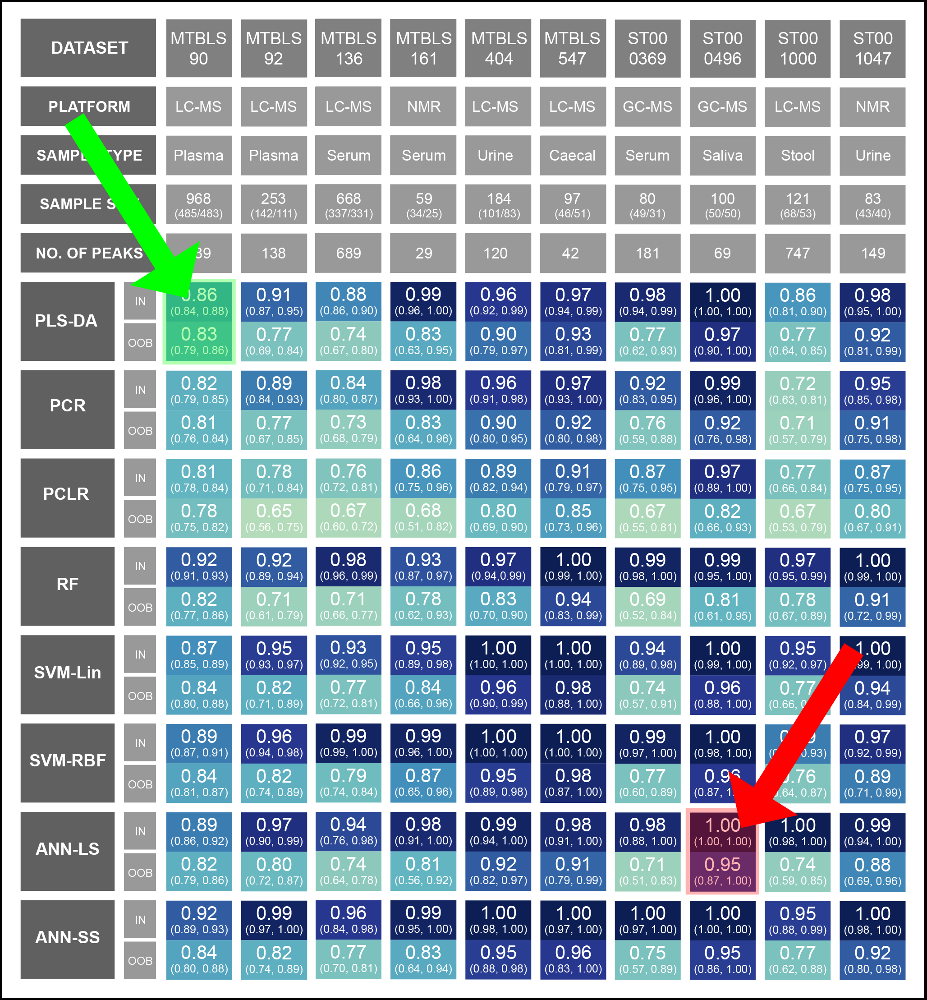

This repository contains the supplementary information for the ___ journal article. In this research article, we compare the predictability of Artificial Neural Networks (ANNs) for binary classification using bootstrap area under the roc curve (AUC) across 10 open-access datasets against other ML methods including partial least squares regression - discriminatory analysis (PLS-DA), principal component regression (PCR), principal component logistic regression (PCLR), random forest (RF), and support vector machine (SVM). For further information on the datasets and methods refer to the respective table at the bottom of this page.

The workflow for each model and dataset includes the following step: import package, load data and peak sheet, extract X and Y, hyperparameter optimisation, build model and evaluate, bootstrap evaluation, and export results. All workflows used the Python programming language, and are published using Jupyter Notebooks in this repository. All Jupyter Notebooks are stored as static Jupyter Notebooks and can be accessed directly through the results table below. In addition, all Jupyter Notebooks can be re-run in the cloud using Binder by clicking the button below:

 

<i style="text-align: justify"> To view the static notebooks that are included in the results table, click the corresponding square. For example, to open the MTBLS90 dataset and PLS-DA method click the area indicated by the green arrow. Alternatively, to open the ST000496 dataset and ANN-LS method click the area indicated by the red arrow. Note: if there are issues, try maximising the webpage.</i>

 

<b style="text-align: justify">  Figure 3 (from the manuscript): Median and 95% CI in-bag and out-of-bag AUC using bootstrap resampling (n=100) for the following datasets and methods. </b>

<map name="results_table">
    <area target="_blank" alt="static" title="static" href="https://cimcb.github.io/MetabComparisonBinaryML/static/PLSDA_MTBLS90.html" coords="149,254,209,325" shape="rect">
    <area target="_blank" alt="static" title="static" href="https://cimcb.github.io/MetabComparisonBinaryML/static/PLSDA_MTBLS92.html" coords="216,254,276,325" shape="rect">
    <area target="_blank" alt="static" title="static" href="https://cimcb.github.io/MetabComparisonBinaryML/static/PLSDA_MTBLS136.html" coords="283,254,343,325" shape="rect">
    <area target="_blank" alt="static" title="static" href="https://cimcb.github.io/MetabComparisonBinaryML/static/PLSDA_MTBLS161.html" coords="350,254,410,325" shape="rect">
    <area target="_blank" alt="static" title="static" href="https://cimcb.github.io/MetabComparisonBinaryML/static/PLSDA_MTBLS404.html" coords="418,254,478,325" shape="rect">
    <area target="_blank" alt="static" title="static" href="https://cimcb.github.io/MetabComparisonBinaryML/static/PLSDA_MTBLS547.html" coords="485,254,544,325" shape="rect">
    <area target="_blank" alt="static" title="static" href="https://cimcb.github.io/MetabComparisonBinaryML/static/PLSDA_ST000369.html" coords="552,254,612,325" shape="rect">
    <area target="_blank" alt="static" title="static" href="https://cimcb.github.io/MetabComparisonBinaryML/static/PLSDA_ST000496.html" coords="619,254,679,325" shape="rect">
    <area target="_blank" alt="static" title="static" href="https://cimcb.github.io/MetabComparisonBinaryML/static/PLSDA_ST001000.html" coords="687,254,747,325" shape="rect">
    <area target="_blank" alt="static" title="static" href="https://cimcb.github.io/MetabComparisonBinaryML/static/PLSDA_ST001047.html" coords="754,254,814,325" shape="rect">
    <area target="_blank" alt="static" title="static" href="https://cimcb.github.io/MetabComparisonBinaryML/static/PCR_MTBLS90.html" coords="149,333,209,404" shape="rect">
    <area target="_blank" alt="static" title="static" href="https://cimcb.github.io/MetabComparisonBinaryML/static/PCR_MTBLS92.html" coords="216,333,276,404" shape="rect">
    <area target="_blank" alt="static" title="static" href="https://cimcb.github.io/MetabComparisonBinaryML/static/PCR_MTBLS136.html" coords="283,333,343,404" shape="rect">
    <area target="_blank" alt="static" title="static" href="https://cimcb.github.io/MetabComparisonBinaryML/static/PCR_MTBLS161.html" coords="350,333,410,404" shape="rect">
    <area target="_blank" alt="static" title="static" href="https://cimcb.github.io/MetabComparisonBinaryML/static/PCR_MTBLS404.html" coords="418,333,478,404" shape="rect">
    <area target="_blank" alt="static" title="static" href="https://cimcb.github.io/MetabComparisonBinaryML/static/PCR_MTBLS547.html" coords="485,333,544,404" shape="rect">
    <area target="_blank" alt="static" title="static" href="https://cimcb.github.io/MetabComparisonBinaryML/static/PCR_ST000369.html" coords="552,333,612,404" shape="rect">
    <area target="_blank" alt="static" title="static" href="https://cimcb.github.io/MetabComparisonBinaryML/static/PCR_ST000496.html" coords="619,333,679,404" shape="rect">
    <area target="_blank" alt="static" title="static" href="https://cimcb.github.io/MetabComparisonBinaryML/static/PCR_ST001000.html" coords="687,333,747,404" shape="rect">
    <area target="_blank" alt="static" title="static" href="https://cimcb.github.io/MetabComparisonBinaryML/static/PCR_ST001047.html" coords="754,333,814,404" shape="rect">
    <area target="_blank" alt="static" title="static" href="https://cimcb.github.io/MetabComparisonBinaryML/static/PCLR_MTBLS90.html" coords="149,412,209,483" shape="rect">
    <area target="_blank" alt="static" title="static" href="https://cimcb.github.io/MetabComparisonBinaryML/static/PCLR_MTBLS92.html" coords="216,412,276,483" shape="rect">
    <area target="_blank" alt="static" title="static" href="https://cimcb.github.io/MetabComparisonBinaryML/static/PCLR_MTBLS136.html" coords="283,412,343,483" shape="rect">
    <area target="_blank" alt="static" title="static" href="https://cimcb.github.io/MetabComparisonBinaryML/static/PCLR_MTBLS161.html" coords="350,412,410,483" shape="rect">
    <area target="_blank" alt="static" title="static" href="https://cimcb.github.io/MetabComparisonBinaryML/static/PCLR_MTBLS404.html" coords="418,412,478,483" shape="rect">
    <area target="_blank" alt="static" title="static" href="https://cimcb.github.io/MetabComparisonBinaryML/static/PCLR_MTBLS547.html" coords="485,412,544,483" shape="rect">
    <area target="_blank" alt="static" title="static" href="https://cimcb.github.io/MetabComparisonBinaryML/static/PCLR_ST000369.html" coords="552,412,612,483" shape="rect">
    <area target="_blank" alt="static" title="static" href="https://cimcb.github.io/MetabComparisonBinaryML/static/PCLR_ST000496.html" coords="619,412,679,483" shape="rect">
    <area target="_blank" alt="static" title="static" href="https://cimcb.github.io/MetabComparisonBinaryML/static/PCLR_ST001000.html" coords="687,412,747,483" shape="rect">
    <area target="_blank" alt="static" title="static" href="https://cimcb.github.io/MetabComparisonBinaryML/static/PCLR_ST001047.html" coords="754,412,814,483" shape="rect">
    <area target="_blank" alt="static" title="static" href="https://cimcb.github.io/MetabComparisonBinaryML/static/RF_MTBLS90.html" coords="149,491,209,562" shape="rect">
    <area target="_blank" alt="static" title="static" href="https://cimcb.github.io/MetabComparisonBinaryML/static/RF_MTBLS92.html" coords="216,491,276,562" shape="rect">
    <area target="_blank" alt="static" title="static" href="https://cimcb.github.io/MetabComparisonBinaryML/static/RF_MTBLS136.html" coords="283,491,343,562" shape="rect">
    <area target="_blank" alt="static" title="static" href="https://cimcb.github.io/MetabComparisonBinaryML/static/RF_MTBLS161.html" coords="350,491,410,562" shape="rect">
    <area target="_blank" alt="static" title="static" href="https://cimcb.github.io/MetabComparisonBinaryML/static/RF_MTBLS404.html" coords="418,491,478,562" shape="rect">
    <area target="_blank" alt="static" title="static" href="https://cimcb.github.io/MetabComparisonBinaryML/static/RF_MTBLS547.html" coords="485,491,544,562" shape="rect">
    <area target="_blank" alt="static" title="static" href="https://cimcb.github.io/MetabComparisonBinaryML/static/RF_ST000369.html" coords="552,491,612,562" shape="rect">
    <area target="_blank" alt="static" title="static" href="https://cimcb.github.io/MetabComparisonBinaryML/static/RF_ST000496.html" coords="619,491,679,562" shape="rect">
    <area target="_blank" alt="static" title="static" href="https://cimcb.github.io/MetabComparisonBinaryML/static/RF_ST001000.html" coords="687,491,747,562" shape="rect">
    <area target="_blank" alt="static" title="static" href="https://cimcb.github.io/MetabComparisonBinaryML/static/RF_ST001047.html" coords="754,491,814,562" shape="rect">
     <area target="_blank" alt="static" title="static" href="https://cimcb.github.io/MetabComparisonBinaryML/static/SVMLin_MTBLS90.html" coords="149,570,209,641" shape="rect">
    <area target="_blank" alt="static" title="static" href="https://cimcb.github.io/MetabComparisonBinaryML/static/SVMLin_MTBLS92.html" coords="216,570,276,641" shape="rect">
    <area target="_blank" alt="static" title="static" href="https://cimcb.github.io/MetabComparisonBinaryML/static/SVMLin_MTBLS136.html" coords="283,570,343,641" shape="rect">
    <area target="_blank" alt="static" title="static" href="https://cimcb.github.io/MetabComparisonBinaryML/static/SVMLin_MTBLS161.html" coords="350,570,410,641" shape="rect">
    <area target="_blank" alt="static" title="static" href="https://cimcb.github.io/MetabComparisonBinaryML/static/SVMLin_MTBLS404.html" coords="418,570,478,641" shape="rect">
    <area target="_blank" alt="static" title="static" href="https://cimcb.github.io/MetabComparisonBinaryML/static/SVMLin_MTBLS547.html" coords="485,570,544,641" shape="rect">
    <area target="_blank" alt="static" title="static" href="https://cimcb.github.io/MetabComparisonBinaryML/static/SVMLin_ST000369.html" coords="552,570,612,641" shape="rect">
    <area target="_blank" alt="static" title="static" href="https://cimcb.github.io/MetabComparisonBinaryML/static/SVMLin_ST000496.html" coords="619,570,679,641" shape="rect">
    <area target="_blank" alt="static" title="static" href="https://cimcb.github.io/MetabComparisonBinaryML/static/SVMLin_ST001000.html" coords="687,570,747,641" shape="rect">
    <area target="_blank" alt="static" title="static" href="https://cimcb.github.io/MetabComparisonBinaryML/static/SVMLin_ST001047.html" coords="754,570,814,641" shape="rect">
     <area target="_blank" alt="static" title="static" href="https://cimcb.github.io/MetabComparisonBinaryML/static/SVMRBF_MTBLS90.html" coords="149,650,209,721" shape="rect">
    <area target="_blank" alt="static" title="static" href="https://cimcb.github.io/MetabComparisonBinaryML/static/SVMRBF_MTBLS92.html" coords="216,650,276,721" shape="rect">
    <area target="_blank" alt="static" title="static" href="https://cimcb.github.io/MetabComparisonBinaryML/static/SVMRBF_MTBLS136.html" coords="283,650,343,721" shape="rect">
    <area target="_blank" alt="static" title="static" href="https://cimcb.github.io/MetabComparisonBinaryML/static/SVMRBF_MTBLS161.html" coords="350,650,410,721" shape="rect">
    <area target="_blank" alt="static" title="static" href="https://cimcb.github.io/MetabComparisonBinaryML/static/SVMRBF_MTBLS404.html" coords="418,650,478,721" shape="rect">
    <area target="_blank" alt="static" title="static" href="https://cimcb.github.io/MetabComparisonBinaryML/static/SVMRBF_MTBLS547.html" coords="485,650,544,721" shape="rect">
    <area target="_blank" alt="static" title="static" href="https://cimcb.github.io/MetabComparisonBinaryML/static/SVMRBF_ST000369.html" coords="552,650,612,721" shape="rect">
    <area target="_blank" alt="static" title="static" href="https://cimcb.github.io/MetabComparisonBinaryML/static/SVMRBF_ST000496.html" coords="619,650,679,721" shape="rect">
    <area target="_blank" alt="static" title="static" href="https://cimcb.github.io/MetabComparisonBinaryML/static/SVMRBF_ST001000.html" coords="687,650,747,721" shape="rect">
    <area target="_blank" alt="static" title="static" href="https://cimcb.github.io/MetabComparisonBinaryML/static/SVMRBF_ST001047.html" coords="754,650,814,721" shape="rect">
    <area target="_blank" alt="static" title="static" href="https://cimcb.github.io/MetabComparisonBinaryML/static/ANNLinSig_MTBLS90.html" coords="149,729,209,800" shape="rect">
    <area target="_blank" alt="static" title="static" href="https://cimcb.github.io/MetabComparisonBinaryML/static/ANNLinSig_MTBLS92.html" coords="216,729,276,800" shape="rect">
    <area target="_blank" alt="static" title="static" href="https://cimcb.github.io/MetabComparisonBinaryML/static/ANNLinSig_MTBLS136.html" coords="283,729,343,800" shape="rect">
    <area target="_blank" alt="static" title="static" href="https://cimcb.github.io/MetabComparisonBinaryML/static/ANNLinSig_MTBLS161.html" coords="350,729,410,800" shape="rect">
    <area target="_blank" alt="static" title="static" href="https://cimcb.github.io/MetabComparisonBinaryML/static/ANNLinSig_MTBLS404.html" coords="418,729,478,800" shape="rect">
    <area target="_blank" alt="static" title="static" href="https://cimcb.github.io/MetabComparisonBinaryML/static/ANNLinSig_MTBLS547.html" coords="485,729,544,800" shape="rect">
    <area target="_blank" alt="static" title="static" href="https://cimcb.github.io/MetabComparisonBinaryML/static/ANNLinSig_ST000369.html" coords="552,729,612,800" shape="rect">
    <area target="_blank" alt="static" title="static" href="https://cimcb.github.io/MetabComparisonBinaryML/static/ANNLinSig_ST000496.html" coords="619,729,679,800" shape="rect">
    <area target="_blank" alt="static" title="static" href="https://cimcb.github.io/MetabComparisonBinaryML/static/ANNLinSig_ST001000.html" coords="687,729,747,800" shape="rect">
    <area target="_blank" alt="static" title="static" href="https://cimcb.github.io/MetabComparisonBinaryML/static/ANNLinSig_ST001047.html" coords="754,729,814,800" shape="rect">
    <area target="_blank" alt="static" title="static" href="https://cimcb.github.io/MetabComparisonBinaryML/static/ANNSigSig_MTBLS90.html" coords="149,808,209,879" shape="rect">
    <area target="_blank" alt="static" title="static" href="https://cimcb.github.io/MetabComparisonBinaryML/static/ANNSigSig_MTBLS92.html" coords="216,808,276,879" shape="rect">
    <area target="_blank" alt="static" title="static" href="https://cimcb.github.io/MetabComparisonBinaryML/static/ANNSigSig_MTBLS136.html" coords="283,808,343,879" shape="rect">
    <area target="_blank" alt="static" title="static" href="https://cimcb.github.io/MetabComparisonBinaryML/static/ANNSigSig_MTBLS161.html" coords="350,808,410,879" shape="rect">
    <area target="_blank" alt="static" title="static" href="https://cimcb.github.io/MetabComparisonBinaryML/static/ANNSigSig_MTBLS404.html" coords="418,808,478,879" shape="rect">
    <area target="_blank" alt="static" title="static" href="https://cimcb.github.io/MetabComparisonBinaryML/static/ANNSigSig_MTBLS547.html" coords="485,808,544,879" shape="rect">
    <area target="_blank" alt="static" title="static" href="https://cimcb.github.io/MetabComparisonBinaryML/static/ANNSigSig_ST000369.html" coords="552,808,612,879" shape="rect">
    <area target="_blank" alt="static" title="static" href="https://cimcb.github.io/MetabComparisonBinaryML/static/ANNSigSig_ST000496.html" coords="619,808,679,879" shape="rect">
    <area target="_blank" alt="static" title="static" href="https://cimcb.github.io/MetabComparisonBinaryML/static/ANNSigSig_ST001000.html" coords="687,808,747,879" shape="rect">
    <area target="_blank" alt="static" title="static" href="https://cimcb.github.io/MetabComparisonBinaryML/static/ANNSigSig_ST001047.html" coords="754,808,814,879" shape="rect">
</map>

 
 

<b style="text-align: justify">  Table 1: Datasets </b>

| Dataset  | Summary                                                                                                                                                                                                                                                                                                                                                                                                                                    |
|----------|--------------------------------------------------------------------------------------------------------------------------------------------------------------------------------------------------------------------------------------------------------------------------------------------------------------------------------------------------------------------------------------------------------------------------------------------|
| [MTBLS90](https://www.ebi.ac.uk/metabolights/MTBLS90)  | A plasma LC-MS dataset consisting of 189 named metabolites. This was a large prospective epidemiological study of men and women at age 70 living in Uppsala, Sweden. For the purpose of this study, we compare males (Class=1; n=485) and females (Class=0; n=483) in a binary discriminant analysis.                                                                                                                                      |
| [MTBLS92](https://www.ebi.ac.uk/metabolights/MTBLS92)  | A plasma LC-MS dataset consisting of 138 named metabolites. The primary outcome for this paper was before and after neoadjuvant chemotherapy in breast cancer patients. For the purpose of this study, we compare before (Class=1; n=142) and after (Class=0; n=111) neoadjuvant chemotherapy in a binary discriminant analysis.                                                                                                           |
| [MTBLS136](https://www.ebi.ac.uk/metabolights/MTBLS136) | A serum LC-MS dataset consisting of 949 named metabolites. The primary outcome for this paper was estrogen-only (E; n=332) vs. estrogen plus progestin (E+P; n=337) vs. non-users of post-menopausal hormone therapy regimes (Control; n=667). For the purpose of this study, we compare only the E vs. E+P in a binary discriminant analysis.                                                                                             |
| [MTBLS161](https://www.ebi.ac.uk/metabolights/MTBLS161) | A serum LC-MS dataset consisting of 29 named metabolites. The primary outcome for this paper was myalgic encephalomyelitis/chronic fatigue syndrome (ME/CFS; n=34) vs. healthy control (HC; n=25), for both serum and urine samples. For the purpose of this study, we compare ME/CFS (Class=1) vs. HC (Class=0) using the serum dataset in a binary discriminant analysis.                                                                |
| [MTBLS404](https://www.ebi.ac.uk/metabolights/MTBLS404) | A urine LC-MS dataset consisting of 120 named metabolites. This paper was an analysis of the variations of the human adult urinary metabolome with age, body mass index, and gender. For the purpose of this study, we compare males (Class=1; n=101) and females (Class=0; n=83) in a binary discriminant analysis.                                                                                                                       |
| [MTBLS547](https://www.ebi.ac.uk/metabolights/MTBLS547) | A caecal content (of mice) LC-MS dataset consisting of 42 named metabolites. The primary outcome for this paper was high fat diet (HFD; n=46) vs. healthy control (HC; n=51). For the purpose of this study, we compare HFD (Class=1) vs. HC (Class=0) in a binary discriminant analysis.                                                                                                                                                  |
| [ST000369](https://www.metabolomicsworkbench.org/data/DRCCMetadata.php?Mode=Study&StudyID=ST000369) | A serum and plasma GC-MS dataset consisting of 181 named metabolites. The primary outcome for this paper was Adenocarcinoma Lung Cancer vs. Healthy Control using two independent case-control studies. For the purpose of this publication, we compare the serum dataset for the first set of independent case-control studies (ADC1): Adenocarcinoma Lung Cancer (Class=1; n=49) vs. Healthy Control (Class=0; n=31).                    |
| [ST000496](https://www.metabolomicsworkbench.org/data/DRCCMetadata.php?Mode=Study&StudyID=ST000496) | A saliva GC-MS dataset consisting of 69 named metabolites. The primary outcome for this paper was to assess the correlation of periodontal inflamed surface area (PISA) and salivary metabolites, before and after debridement. For the purpose of this publication, we compare the secondary outcome in a binary discriminant analysis: before debridement (Class=0; n=50) and after debridement (Class=1; n=50).                         |
| [ST001000](https://www.metabolomicsworkbench.org/data/DRCCMetadata.php?Mode=Study&StudyID=ST001000) | A stool LC-MS dataset (4 modes- HILICpos, HILICneg, C18neg, C8pos) consisting of >8,000 measured metabolite features. The primary outcome for this paper was healthy controls vs. inflammatory bowel disease (IBD), which includes Crohn's disease (CD) and ulcerative colitis (UC). For the purpose of this publication, we compare UC (Class=1; n=68) and CD (Class=0; n=53) using the C18neg dataset in a binary discriminant analysis. |
| [ST001047](https://www.metabolomicsworkbench.org/data/DRCCMetadata.php?Mode=Study&StudyID=ST001047) | A urine NMR data set consisting of 149 named metabolites. The primary outcome for this paper was the urine was Gastric Cancer (GC; n=43) v Benign Tumor (BN; n=40) v Healthy Control (HE; n=40). For the purposes of this publication we compare only the GC vs HE samples in a binary discrimiant analysis.                                                                                                                               |

 

<b style="text-align: justify">  Table 2: Methods </b>

| Method                                                                           | Summary                                                                                                                                                                                                                                                                                                                                                                                                                                                                                                                                                                                                        |
|----------------------------------------------------------------------------------|----------------------------------------------------------------------------------------------------------------------------------------------------------------------------------------------------------------------------------------------------------------------------------------------------------------------------------------------------------------------------------------------------------------------------------------------------------------------------------------------------------------------------------------------------------------------------------------------------------------|
| [PLS-DA](https://www.sciencedirect.com/science/article/abs/pii/016974399385002X) | Partial least squares discriminant analysis was implemented using the SIMPLS algorithm. Refer to [De Jong (1993)](https://www.sciencedirect.com/science/article/abs/pii/016974399385002X) for details on the SIMPLS algorithm.                                                                                                                                                                                                                                                                                                                                                                                 |
| [PCR](https://link.springer.com/content/pdf/10.1007/978-3-642-04898-2_455.pdf)   | Principal component regression is a two-stage algorithm combining principal component analysis (PCA) and multiple linear regression (MLR), where the first N principal component scores act as the independent variables of the MLR, and the binary classification the is the dependent variable. The value of N is chosen by the user. PCA was implemented using [PCA](https://scikit-learn.org/stable/modules/generated/sklearn.decomposition.PCA.html) and MLR using [Linear Regression](https://scikit-learn.org/stable/modules/generated/sklearn.linear_model.LinearRegression.html) from scikit-learn.   |
| [PCLR](https://doi.org/10.1007/978-3-642-57678-2_16)                             | Principal component logistic regression is a two-stage algorithm combining principal component analysis (PCA) and logistic regression, where the first N principal component scores act as the independent variables of the logistic regression, and the binary classification is the dependent variable. The value of N is chosen by the user. PCA was implemented using [PCA](https://scikit-learn.org/stable/modules/generated/sklearn.decomposition.PCA.html) and [Logistic Regression](https://scikit-learn.org/stable/modules/generated/sklearn.linear_model.LogisticRegression.html) from scikit-learn. |
| [RF](https://doi.org/10.1002/widm.1301)                                          | Random forest was implemented using [Random Forest Classifier](https://scikit-learn.org/stable/modules/generated/sklearn.ensemble.RandomForestClassifier.html) from scikit-learn.                                                                                                                                                                                                                                                                                                                                                                                                                              |
| [SVM-Lin](http://image.diku.dk/imagecanon/material/cortes_vapnik95.pdf)          | Linear kernel support vector machine was implemented using [Support Vector Classifier](https://scikit-learn.org/stable/modules/generated/sklearn.svm.SVC.html) from scikit-learn.                                                                                                                                                                                                                                                                                                                                                                                                                              |
| [SVM-RBF](http://image.diku.dk/imagecanon/material/cortes_vapnik95.pdf)          | Radial basis function kernel support vector machine was implemented using [Support Vector Classifier](https://scikit-learn.org/stable/modules/generated/sklearn.svm.SVC.html) from scikit-learn.                                                                                                                                                                                                                                                                                                                                                                                                               |
| [ANN-LS](http://neuralnetworksanddeeplearning.com/)                              | 2 layer artificial neural network with layer 1 consisting of multiple neurons (n = 2 to 6) with a linear activation, and layer 2 (output layer) consisting of a single neuron with a sigmoidal activation function. ANN was implemented using [Keras](https://keras.io/) with a [TensorFlow backend](https://www.tensorflow.org/).                                                                                                                                                                                                                                                                             |
| [ANN-SS](http://neuralnetworksanddeeplearning.com/)                              | 2 layer artificial neural network with layer 1 consisting of multiple neurons (n = 2 to 6) with a sigmoidal activation, and layer 2 (output layer) consisting of a single neuron with a sigmoidal activation function. ANN was implemented using [Keras](https://keras.io/) with a [TensorFlow backend](https://www.tensorflow.org/).                                                                                                                                                                                                                                                                          |

 
